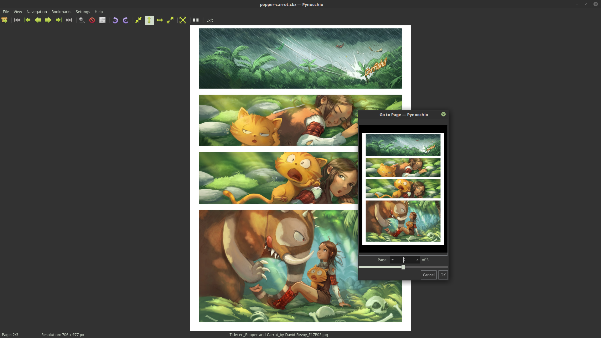

<h1 align="center">
   
  
   
  Pynocchio
   
</h1>

<h4 align="center">A minimalist comic reader</h4>

  
  
  
  
    
    

  <a href="#features">Features</a> | 
  <a href="#installation">Installation</a> |
  <a href="#contributing">Contributing</a> |
  <a href="#credits">Credits</a>

* This screenshots contains a page of the webcomic [Pepper&Carrot](https://www.peppercarrot.com/) by David Revoy licensed under the [Creative Commons Attribution 4.0 International (CC BY 4.0)](https://creativecommons.org/licenses/by/4.0/).

## Features

The current version is stable and we intend to improve it even more.

* Support several view adjust modes using anti-aliasing.
* Support the several image formats provide by Qt5: WEBP, JPG, JPEG, PNG, GIF, BMP, PBM, PGM, PPM, XBM, XPM.
* Support a several comic formats like .ZIP, .RAR, .TAR, .CBT, .CBR, .CBZ.
* Double page and manga read mode
* Elegant visual, free and easy to use! :) 

## Installation

Please, download the latest release [here](https://github.com/mstuttgart/pynocchio/releases/latest), in [Linux Apps](https://www.linux-apps.com/p/1126786).

## Contributing

If you'd like to contribute, please see [CONTRIBUTING.rst](https://github.com/mstuttgart/pynocchio/blob/develop/CONTRIBUTING.rst).

* [Authors](https://github.com/mstuttgart/pynocchio/blob/develop/AUTHORS.rst)

## Credits

### Third party resources

Pynocchio use [Elementary USU Icon Theme](https://store.kde.org/content/show.php/elementary+USU?content=148128) icon set free pack.

Copyright (C) 2014-2019 by Michell Stuttgart
