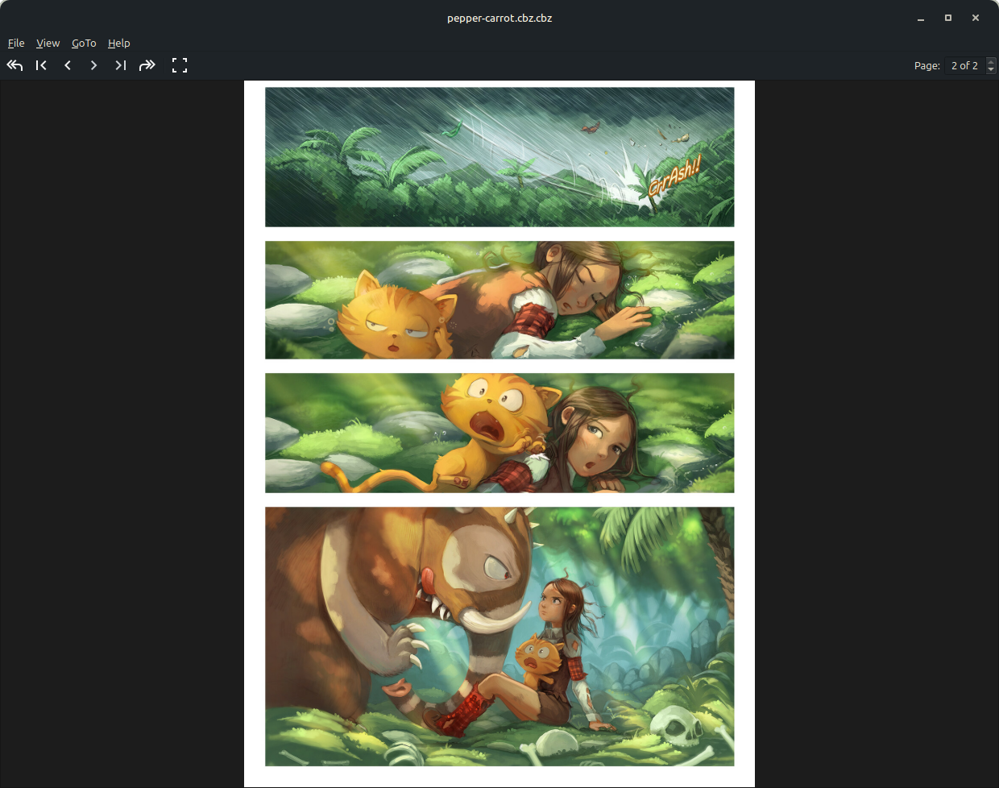

<h1 align="center">
   
  
   
  Pynocchio
   
</h1>

<h4 align="center">A minimalist comic reader</h4>

  
  
  
  

  <a href="#features">Features</a> |
  <a href="#installation">Installation</a> |
  <a href="#contributing">Contributing</a> |
  <a href="#credits">Credits</a>

  

  <em>This screenshot contains a page of the webcomic <a href="https://www.peppercarrot.com/">Pepper&Carrot</a> by David Revoy, licensed under the <a href="https://creativecommons.org/licenses/by/4.0/">Creative Commons Attribution 4.0 International (CC BY 4.0)</a>.</em>

## Features

The current version is stable, and we aim to improve it further.

* Supports several view adjustment modes with anti-aliasing.
* Compatible with multiple image formats supported: WEBP, JPG, JPEG, PNG, GIF, BMP, PBM, PGM, PPM, XBM, XPM.
* Supports various comic archive formats: `.ZIP`, `.RAR`, `.TAR`, `.CBT`, `.CBR`, `.CBZ`.
* Support PDF comic files.
* Minimalist design, free, and easy to use!

## Installation

Download latest release [here](https://github.com/mstuttgart/pynocchio/releases).

## Contributing

If you'd like to contribute, please see the [CONTRIBUTING](https://github.com/mstuttgart/pynocchio/blob/develop/CONTRIBUTING) file.

## Credits

Copyright (C) 2014-2025 by Michell Stuttgart
